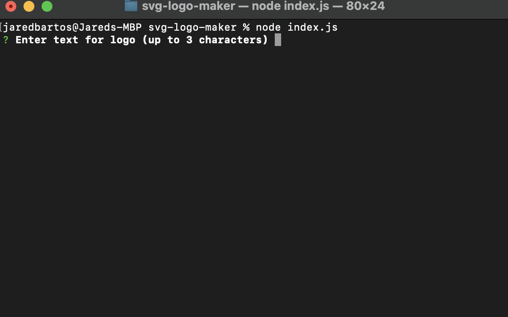
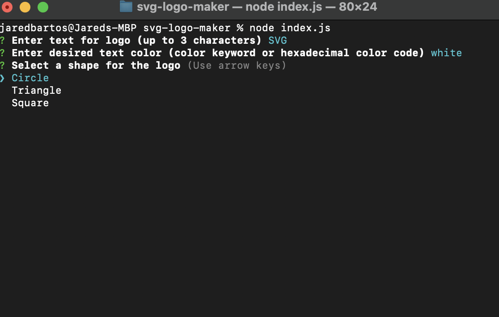
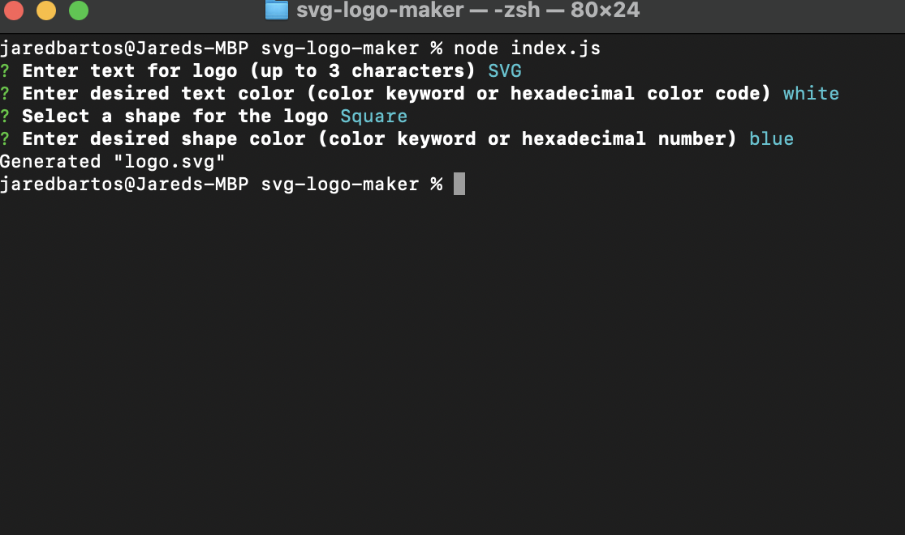

# SVG Logo Maker

## Description

This application is a SVG logo generator, which gives developers a quick and easy way to generate a logo for their app, so they can spend more time developing features.

## Table of Contents
- [Installation](#installation)
- [Requirements](#requirements)
- [Usage](#usage)
- [Tests](#tests)
- [License](#license)
- [Questions](#questions)
- [Link to Demonstration Video](#link-to-demonstration-video)
- [Screenshots](#screenshots)

## Installation

To install the application, download the zip file from the GitHub repo, or clone the repo into your chosen directory.

## Requirements

[Node.js](https://nodejs.org/en)

## Usage

To use the Professional README Generator, open your terminal and navigate to the directory where the downloaded folder resides.

Enter the following command to install required node modules:

<code>npm i</code>

Then enter:

<code>node index.js</code> 

Answer the prompts to generate your logo.

Your logo will be created under the name "logo.svg" in the same directory as the index.js file.

It can then be edited and renamed to your discretion.

## Tests

Test files made using Jest can be found in the "test" folder.

To run the tests, follow instructions in Usage section of README to install the required node modules.

Once those are installed, while in the repo directory, enter the following command to run the tests:

<code>npm run test</code>

## License

This application is covered under MIT License.

Please refer to the LICENSE file in repo for more information.

## Questions

My GitHub profile: https://github.com/jaredbartos

If you have any further questions, please contact me through email.

jaredbartos@gmail.com

## Link to Demonstration Video

https://drive.google.com/file/d/1qxMgKWCQpFTdqh8j7YDQLlS1vGY4lZcc/view?usp=sharing

## Screenshots

